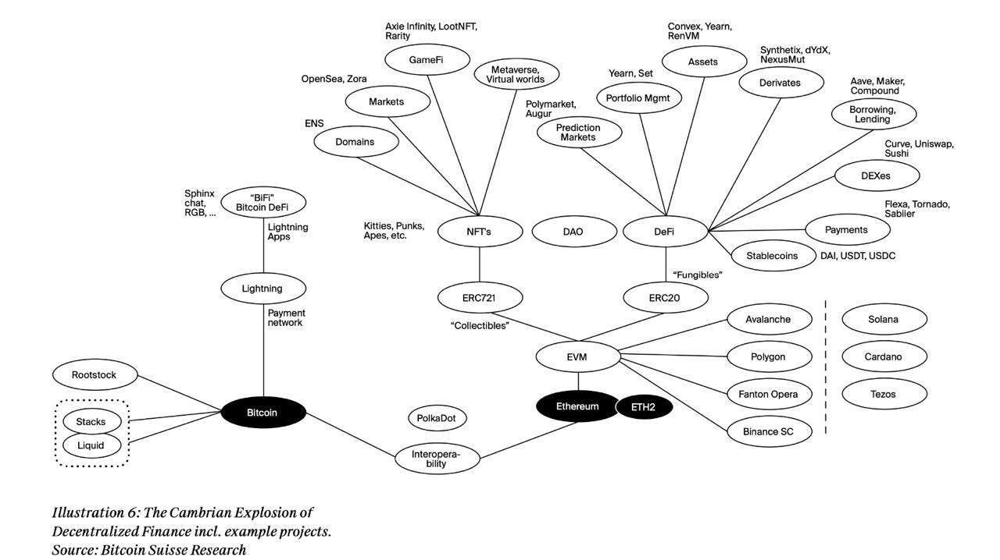

# The Blockchain path

* A set of blockchain resources along with some snippets. Developer view. 
* In memorial of @ajlopez and his repositories of DeFi learning resources. 

*******************

- [The Blockchain path](#the-blockchain-path)
  * [Smart Contracts](#smart-contracts)
    + [Basics](#basics)
    + [Advanced](#advanced)
    + [Security](#security)
    + [Gas optimizations](#gas-optimizations)
    + [EIPs](#eips)
  * [DeFI](#defi)
    + [Yield Farming](#yield-farming)
    + [Automated market maker](#automated-market-maker)
    + [Borrowing and lending](#borrowing-and-lending)
    + [Flash loans](#flash-loans)
    + [Oracles](#oracles)
  * [Other blockchains](#other-blockchains)
    + [Algorand](#algorand)
    + [Cosmos](#cosmos) 
    + [RSK](#rsk)
    + [Solana](#solana)
    + [Polygon](#polygon)
    + [Polkadot](#polkadot)
  * [Glossary and technical mix](#glossary-and-technical-mix)
    + [Frameworks and utilities](#frameworks-and-utilities)

*******************
## Smart Contracts

### Basics

* Function types:
	* [sc-function-types-I](https://medium.com/@yangnana11/solidity-function-types-4ad4e5de6d56#:~:text=Internal%20functions%20can%20only%20be,context%20of%20the%20current%20contract)
	* [External vs public](https://ethereum.stackexchange.com/questions/19380/external-vs-public-best-practices)
	* [Overrides modifier](https://docs.soliditylang.org/en/latest/contracts.html#function-overriding)

* Variables: 
	* [I](https://betterprogramming.pub/learn-solidity-variables-part-1-657fc27c2cc1)
	* [II](https://betterprogramming.pub/learn-solidity-variables-part-2-f3b842f5bfb8)

* Fallback functions:
	* [Fallback](https://medium.com/upstate-interactive/the-truth-about-fallback-functions-in-solidity-a2c604f8e66b)
	* [Fallback II](https://www.tutorialspoint.com/solidity/solidity_fallback_function.htm)

* [Interfaces](https://www.geeksforgeeks.org/solidity-basics-of-interface/)

* [Libraries](https://jeancvllr.medium.com/solidity-tutorial-all-about-libraries-762e5a3692f9#:~:text=A%20library%20in%20Solidity%20is,in%20a%20more%20modular%20way)

* Testing: 
	* [Technical guide on how to write good unit tests in sc](https://medium.com/upstate-interactive/a-simple-guide-for-how-to-write-unit-tests-for-smart-contracts-8ec4b645f57b)

### Advanced

* [DelegateCalls](https://medium.com/coinmonks/delegatecall-calling-another-contract-function-in-solidity-b579f804178c)

* Upgradable SC: 
	* [Not all contracts are inmutable](https://betterprogramming.pub/not-all-smart-contracts-are-immutable-create-upgradable-smart-contracts-e4e933b7b8a9)
	* [Detailed explanation and Oz implementation](https://simpleaswater.com/upgradable-smart-contracts/)
	* [CardStack in-house solution](https://medium.com/cardstack/upgradable-contracts-in-solidity-d5af87f0f913)

* [Hooks](https://docs.openzeppelin.com/contracts/3.x/extending-contracts)

* [Bytes I (official doc)](https://www.tutorialspoint.com/solidity/solidity_strings.htm)
* [Bytes II (old post)](https://medium.com/@libertylocked/what-are-abi-encoding-functions-in-solidity-0-4-24-c1a90b5ddce8)
* [Bytes III (more complete)](https://docs.soliditylang.org/en/latest/contracts.html#function-overriding)

* [Abstract vs Interfaces](https://medium.com/upstate-interactive/solidity-how-to-know-when-to-use-abstract-contracts-vs-interfaces-874cab860c56)

* [Integration with Oz contracts](https://docs.openzeppelin.com/contracts/3.x/extending-contracts)

* [Pausable Example Contract](https://fravoll.github.io/solidity-patterns/emergency_stop.html)

### Security 

* [Reentracy](https://blockman.medium.com/reentrancy-a-vulnerability-that-causes-your-solidity-smart-contract-to-be-withdrawn-all-money-f4a9f6cdc57)
* [Reentrancy after Istanbul fork](https://blog.openzeppelin.com/reentrancy-after-istanbul/)

### Gas optimizations 

* [Gas tips](https://mudit.blog/solidity-gas-optimization-tips/)
* [Gas tips updated](https://blog.polymath.network/solidity-tips-and-tricks-to-save-gas-and-reduce-bytecode-size-c44580b218e6)
* [Storage is expensive](https://medium.com/geekculture/hitchhikers-guide-to-the-evm-56a3d90212ac)
* [Stack too deep and solution](https://medium.com/1milliondevs/compilererror-stack-too-deep-try-removing-local-variables-solved-a6bcecc16231)

### EIPs

* EIP-155: Chain ID 
* EIP-712: Standard for typed message signing
	* https://medium.com/metamask/eip712-is-coming-what-to-expect-and-how-to-use-it-bb92fd1a7a26
	* https://medium.com/coinmonks/eip712-a-full-stack-example-e12185b03d54
	* https://dev.to/zemse/ethersjs-signing-eip712-typed-structs-2ph8
* EIP-1167: Proxy Contract
	* https://eips.ethereum.org/EIPS/eip-1167
	* https://github.com/optionality/clone-factory/blob/master/contracts/CloneFactory.sol
* EIP-1344: Chain ID Opcode
* EIP-1559: Gas Fee calculations
	* https://www.blocknative.com/blog/eip-1559-fees
* EIP-777: Enhaced ERC20 tokens
	* https://eips.ethereum.org/EIPS/eip-777
* EIP-4626: Tokenized Vaults
* EIP-2981: NFT Royalties

**********************************

## DeFI

### Yield Farming

* [Yield Farming (Es)](https://academy.bit2me.com/que-es-el-yield-farming/)
* [Yield Farming (En)](https://academy.binance.com/en/articles/what-is-yield-farming-in-decentralized-finance-defi)

### Automated market maker
* [AMM](https://academy.binance.com/en/articles/what-is-an-automated-market-maker-amm)

### Borrowing and lending

* [Compound docs](https://compound.finance/docs)
* [Compound - Lending](https://medium.com/compound-finance/supplying-assets-to-the-compound-protocol-ec2cf5df5aa)
* [Compound - Borrowing](https://medium.com/compound-finance/borrowing-assets-from-compound-quick-start-guide-f5e69af4b8f4)
* [Gemini explanation](https://www.gemini.com/cryptopedia/what-is-compound-and-how-does-it-work#section-the-compound-de-fi-protocol)

### Flash loans

* [Decrypt](https://decrypt.co/resources/what-are-flash-loans-the-defi-lending-phenomenon-explained)
* [Binance](https://academy.binance.com/en/articles/what-are-flash-loans-in-defi)
* [Medium Geek Culture](https://medium.com/geekculture/what-is-a-defi-flash-loans-flash-loan-attack-c130c83d9811)
* [101 Blockchains](https://101blockchains.com/defi-flash-loans/)
* [AAVE Technical docs](https://docs.aave.com/developers/guides/flash-loans)

### Oracles

* [Why oracles](https://medium.com/iex-ec/why-your-dapp-needs-a-decentralized-oracle-2f2403f9fd7)
* [MakerDao Medianizer](https://developer.makerdao.com/feeds/)

* [TVL Tracker](https://defipulse.com/)

### Vaults

* [Vaults explained](https://blog.apy.vision/defi-vaults/)
* [yDAI exploit](https://swissborg.com/blog/flash-loan-attack)

### Yield aggregators

* [Verso](https://verso.finance/the-mechanics-of-yield-farming-and-yield-aggregators/#:~:text=Yield%20farming%20aggregators%20essentially%20automate,maximizing%20yields%20via%20auto%20compounding.)
* [Eqifi](https://eqifi.medium.com/defi-explained-what-is-a-yield-aggregator-e611f0cf969b)
* [Stakingbits](https://medium.com/stakingbits/what-is-yield-farming-and-a-yield-aggregator-8161e7a74b43)
* [Hackernoon](https://hackernoon.com/how-do-yield-aggregators-work)

### NFT Staking

* [Moonpay thorough doc](https://www.moonpay.com/nft/nft-staking)
* [Example repo using ERC1155](https://github.com/karangorania/nft-staking)

**********************

## Other blockchains

## Algorand

* [Standard assets (ASA)](https://developer.algorand.org/docs/features/asa/)
* [Stateful Smart Contracts](https://developer.algorand.org/docs/features/asc1/stateful/)
* [Statless Smart Contracts](https://pyteal.readthedocs.io/en/stable/overview.html)
* [Teal Guidelines](https://developer.algorand.org/docs/features/asc1/stateful/)
* [PyTeal overview](https://developer.algorand.org/docs/features/asc1/teal/pyteal/)

## Cosmos

* [IBC-Protocol](https://ibcprotocol.org/)
* [SDK](https://docs.cosmos.network/v0.44/)
* [Starport](https://docs.starport.com/)
* [Cosmwasm](https://cosmwasm.com/)
	* [Contract semantics](https://docs.cosmwasm.com/docs/1.0/smart-contracts/contract-semantics)
	* [Contract analysis](https://docs.cosmwasm.com/tutorials/simple-option/develop)
	* [Anatomy of smart contract](https://docs.cosmwasm.com/dev-academy/develop-smart-contract/intro)
	* [Cosmwasm for developers](https://blog.cosmos.network/cosmwasm-for-developers-7640ee38430f)

## Near

## RSK

* [Rlogin](https://github.com/wighawag/tutorial-hardhat-deploy)
* [RSK Swap](https://rskswap.com/docs/v2/protocol-overview/how-rskswap-works)
* [RSK Swap SC](https://rskswap.com/docs/v2/smart-contract-integration/quick-start/)

## Solana

### Basic

* [Progamming Solana](https://paulx.dev/blog/2021/01/14/programming-on-solana-an-introduction/)
* [Solana 101](https://learn.figment.io/tutorials/solana-101)
* [Solana for technicals](https://2501babe.github.io/posts/solana101.html)
* [Solana cookbook](https://solanacookbook.com/#contributing)
* [Solana transactions in depth](https://medium.com/@asmiller1989/solana-transactions-in-depth-1f7f7fe06ac2)

### Native programs

* [Explanation](https://medium.com/coinmonks/solana-internals-part-1-what-are-the-native-on-chain-programs-and-why-do-they-matter-61c981483e86)

### SPL TOKEN

* [CLI](https://medium.com/@kaloliya/step-by-step-guide-for-creating-a-token-on-solana-network-68d3b890ca84)
* [Code explnation along with example](https://medium.com/credix/building-an-spl-token-faucet-on-solana-2b8a07d364ff)
* [Technical explanation](https://medium.com/credix/building-an-spl-token-faucet-on-solana-2b8a07d364ff)

**********************

## Zero knowledge

## Glossary and technical mix 

* [Bear and bull market](https://academy.binance.com/en/glossary/bear-market)
* [Tokens Comparisson](https://medium.com/coinmonks/token-standards-erc20-vserc721-vs-erc1155-3106f1e3f2f3)
* [ERC20 Tutorial](https://medium.com/crypto-currently/the-anatomy-of-erc721-e9db77abfc24#:~:text=Ethereum%20Request%20for%20Comments%20721,the%20tokens%20are%20non%2Dfungible%20)
* [ERC721 detailed](https://medium.com/crypto-currently/the-anatomy-of-erc721-e9db77abfc24#:~:text=Ethereum%20Request%20for%20Comments%20721,the%20tokens%20are%20non%2Dfungible%20)
* [Randomness](https://betterprogramming.pub/how-to-generate-truly-random-numbers-in-solidity-and-blockchain-9ced6472dbdf)
* [Vanity addresses](https://academy.bit2me.com/en/what-is-a-vanity-address/#:~:text=Vanity%20addresses%2C%20or%20vanity%20addresses,up%20the%20security%20they%20provide.)
* IPFS
	* [Official](https://ipfs.io/)
	* [Hands on tutorial](https://medium.com/coinmonks/a-hands-on-introduction-to-ipfs-ee65b594937)

### Frameworks and utilities

* Hardhat 
	* [Hardhat-deploy-plugin-tutorial](https://github.com/wighawag/tutorial-hardhat-deploy)

* TheGraph
	* [Official-QS](https://thegraph.com/docs/en/developer/quick-start/)
	* [Thorough documentation](https://thegraph.com/docs/en/developing/creating-a-subgraph/)
	* [Mappings](https://thegraph.com/docs/en/developing/creating-a-subgraph/#writing-mappings)
	* [Deploying subgraph](https://medium.com/xord/the-graph-network-part-ii-deploying-the-subgraph-xord-a80b454d96d2)
	* [Unit testing](https://thegraph.com/docs/en/developing/unit-testing-framework/)
	* [Celo smart contracts subgraphs](https://learn.figment.io/tutorials/celo-subgraphs)

* Anchor 
	* [Official docs](https://project-serum.github.io/anchor/getting-started/introduction.html)
	* [Anchor simplified for newcomers](https://hashnode.com/post/anchor-framework-simplified-for-new-developers-in-solana-cktyttmwf09h6bps189wxcngd)
	* [Contexts, PDAs and seeds](https://2501babe.github.io/posts/anchor101.html)

* Solana-cli
	* [Installation](https://docs.solana.com/cli/install-solana-cli-tools)
	* [Official usage](https://docs.solana.com/cli/conventions)
	* [Basic operations](https://medium.com/@lianxiongdi/solana-development-1-basic-operation-of-solana-cli-dcf156137e6)
	* [Create Token using cli](https://medium.com/@lianxiongdi/solana-development-2-create-your-own-token-bfd4e53c3840)

* Truffle: 
	* [under the hood migrate](https://medium.com/@blockchain101/demystifying-truffle-migrate-21afbcdf3264)
